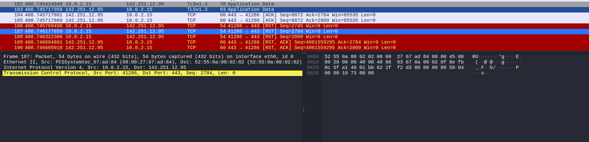
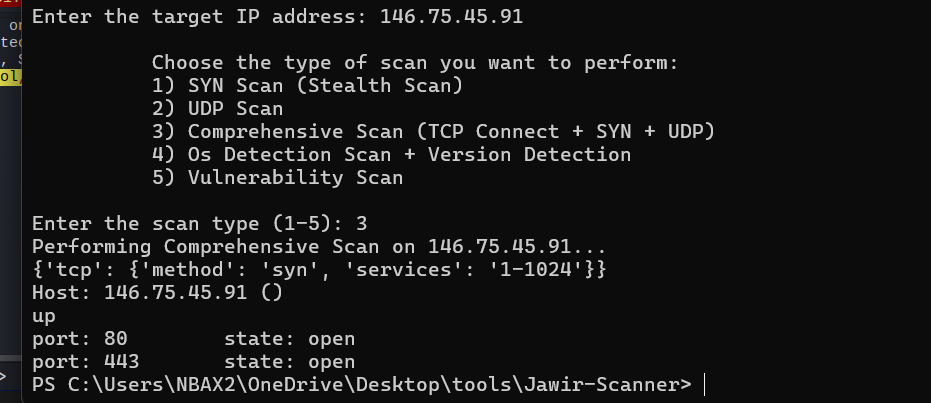
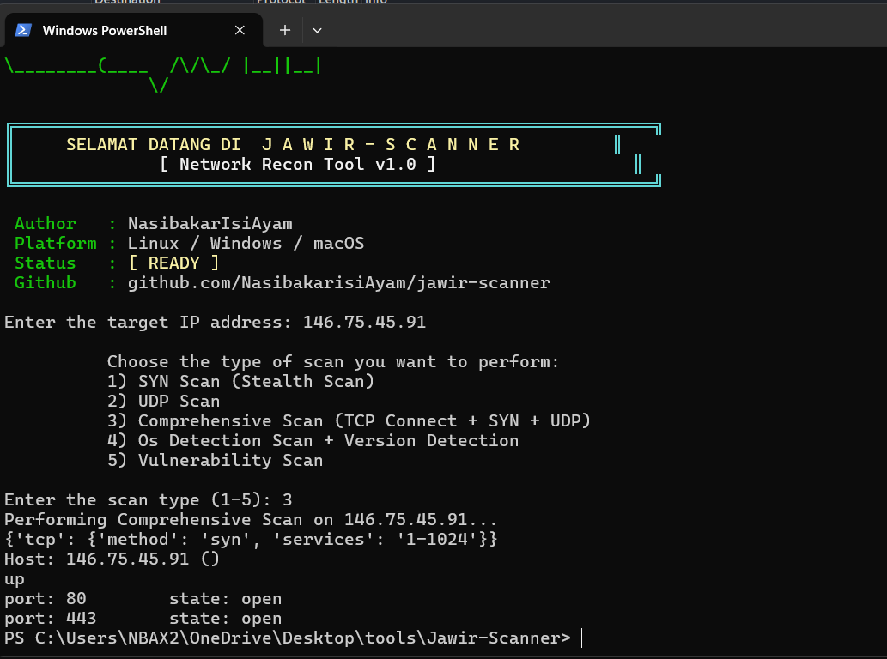

# Portfolio: Automating Network Reconnaissance with Jawir-Scanner and Analyzing Traffic Signatures via Wireshark

## 1. Executive Summary
This portfolio presents a professional network reconnaissance assessment using `Jawir-Scanner` and `Wireshark`. The exercise demonstrates how automated SYN scan execution identifies network hosts and open services, while packet capture analysis reveals the scanner's traffic signatures and residual artifacts.

## 2. Architecture Lab Environment
The lab environment is built on a Kali Linux virtual machine configured as the scanning workstation.

- Platform: Kali Linux VM
- IP Address: `146.75.45.91`
- Scanning Tool: `Jawir-Scanner`
- Packet Analysis: `Wireshark`

The Kali VM operates in an isolated test network, with targets placed on the same subnet to ensure safe, controlled reconnaissance and traffic capture.

## 3. Script Execution & Traffic Signature Analysis
The assessment used `Jawir-Scanner` to execute an automated SYN scan across target addresses and ports. This method is chosen for its ability to rapidly discover listening TCP services with minimal full-handshake exposure.

Example execution command:

```bash
python3 jawir-scanner.py --target 146.75.45.91 --scan-type syn --ports 1-1024
```

During the scan, `Wireshark` recorded packet activity to capture the scanner's traffic signature:

- SYN packets from the Kali VM source IP `146.75.45.91`
- TCP responses: SYN/ACK for open ports, RST for closed ports
- No completed TCP handshake on most probes, indicating half-open scanning behavior

### Traffic Signature Highlights
- Repeated SYN packets to sequential port ranges
- Short inter-packet intervals typical of automated scanning
- Distinct source port reuse patterns from `Jawir-Scanner`
- RST replies showing scanner probe rejection behavior


*Jawir-Scanner execution and scan results.*


*Wireshark packet capture overview during SYN scanning.*


*Detailed SYN scan signature analysis in Wireshark.*

## 4. Key Network Artifacts Left by Scanner
The automated SYN scan produces observable artifacts that can be used for detection and forensic analysis:

- SYN packets from `146.75.45.91` to target hosts
- High volume of probes to multiple destination ports
- RST packets from targets indicating closed services
- Repeated connection attempts with similar source port patterns
- Anomalous traffic bursts not consistent with normal user behavior

These artifacts are critical for defenders when constructing intrusion detection rules and incident investigations.

## 5. Defensive Mitigation & Conclusion
### Defensive Mitigation
To mitigate reconnaissance risk and detect automated scanning activity:

- Deploy intrusion detection/prevention systems (IDS/IPS) with SYN scan signatures
- Monitor for unusual patterns of repeated SYN probes from a single source
- Implement rate limiting and TCP SYN cookies on exposed services
- Maintain strict firewall rules and service exposure minimization

### Conclusion
This portfolio proves that automated network reconnaissance using `Jawir-Scanner` can efficiently identify service exposure, while `Wireshark` provides the packet-level visibility needed to characterize scanner behavior. The analysis also highlights actionable defensive controls to detect and mitigate SYN-based scanning activity in production networks.
